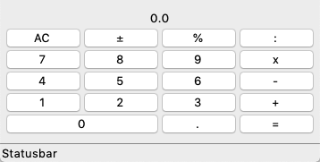
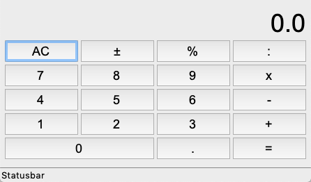
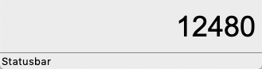
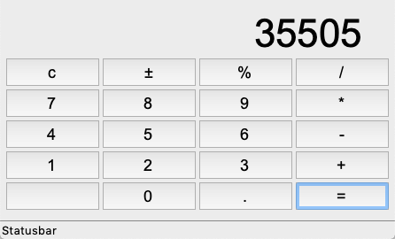

Applications
============

In this section we are showing some practical applications. 

Calculator
----------

The first example is a pocket calculator.

First, we just do the layout for the buttons::

    App.lb = Label('0.0')
    App.lb.grid(columnspan=4)

    Button('AC', ).grid(row=1)
    Button('±').grid(row=1, column=1)
    Button('%').grid(row=1, column=2)
    Button(':').grid(row=1, column=3)

.. literalinclude:: calc1.py

:download:`calc1.py<calc1.py>`

Then we are going to add callback functions to the keys::

        Button('7', 'App.lb["text"]  = float(App.lb["text"])*10 + 7').grid(row=2, column=0)
        Button('8', 'App.lb["text"]  = float(App.lb["text"])*10 + 8').grid(row=2, column=1)
        Button('9', 'App.lb["text"]  = float(App.lb["text"])*10 + 9').grid(row=2, column=2)
        Button('x').grid(row=2, column=3)

.. literalinclude:: calc2.py

:download:`calc2.py<calc2.py>`

It turns out that it is simpler to place the calculator logic into 
a separate function, based on a single character::

    def calculate(self, c):
        """Calculator for 4 basic operations."""
        if c in '0123456789.±+-/*%c=':
            if c in '0123456789':
                if self.pos:
                    self.val += int(c) * 10**self.pos
                    self.pos -= 1
                else:
                    self.val *= 10
                    self.val += int(c)
            if c == '.':
                self.pos = -1
            if c == '%':
                self.val *= 0.01
            elif c in '+-/*':
                self.val2 = self.val
                self.val = 0
                self.pos = 0
                self.op = c
            elif c == '=':
                e = str(self.val2) + self.op + str(self.val)
                self.val = eval(e)
            if c == 'c':
                self.val = 0
                self.pos = 0

            self.lb['text'] = self.val

.. literalinclude:: calc3.py

:download:`calc3.py<calc3.py>`

And finally we put everything together.  
New Calculator instances can be created via a button press or via a menu.

.. literalinclude:: calc4.py

:download:`calc4.py<calc4.py>`