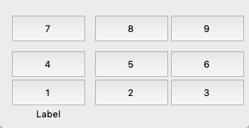
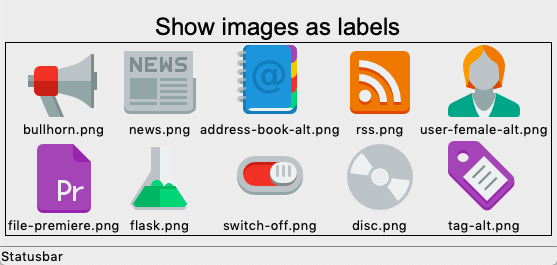
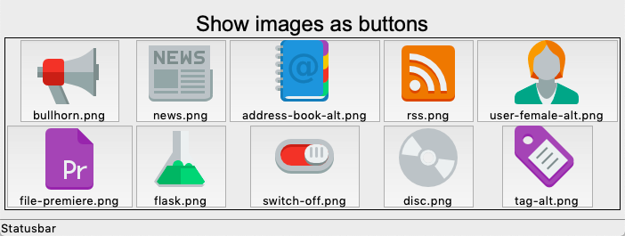
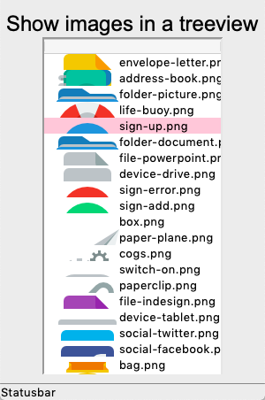
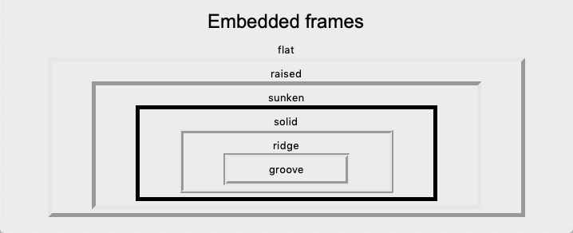
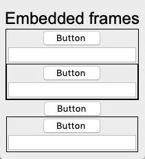

Basic widgets
=============

In this section we are going to look in more detail at these basic widgets:

* Button
* Label
* Entry
* Frame

Button
------

Buttons have text, a command and keyword arguements::

    Button()
    Button('Print 123', 'print(123)', padding=10)
    Button('Hello', 'print("Hello " * 3)', default='active')

The first button has the default text *Button* and does nothing. 

The second button has a padding of 10 pixels and prints 
``.!frame.!button2``

The third button is active by default and prints::
``Hello Hello Hello``

.. literalinclude:: button1.py

:download:`button1.py<button1.py>`

Buttons which create buttons
----------------------------

Buttons can also be created or deleted dynamically: 

* The first button creates another default button.
* The second button creates a self-destroy button. 

.. literalinclude:: button2.py

:download:`button2.py<button2.py>`

Fonts
-----

Labels can use different fonts and size.

.. literalinclude:: font1.py

:download:`font1.py<font1.py>`

Display a label with an image with
----------------------------------

Labels can be displayed with an additional image.
The image position can be:

* center
* left/right
* top/bottom

.. literalinclude:: label1.py

:download:`label1.py<label1.py>`

Display a images as labels
--------------------------

.. literalinclude:: label2.py

:download:`label2.py<label2.py>`

Display a images as buttons
---------------------------

.. literalinclude:: label3.py

:download:`label3.py<label3.py>`

Display a images in a listbox
-----------------------------

.. literalinclude:: label4.py

:download:`label4.py<label4.py>`

Embedded frames
---------------

.. literalinclude:: frame1.py

:download:`frame1.py<frame1.py>`

Embedded frames
---------------

.. literalinclude:: frame2.py

:download:`frame2.py<frame2.py>`
