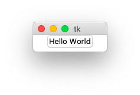
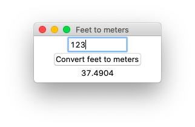
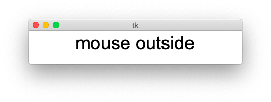
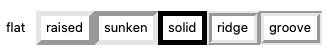
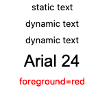

Button
======

Let's start with a simple example of creating a button
which displays some text.

A one-button program
--------------------

First we import the ``tkinter`` module and give it the shorter name ``tk``::

    import tkinter as tk

Then we create a ``Tk`` root object which represents the window
and will be the parent for all the other widgets::

    root = tk.Tk()

Then we create a button object which has root as parent,
and to which we give the text *Hello world*.
This object calls the method ``pack()``
which makes the button visible in the window.
Finally root calls the ``mainloop()`` method to start the program::

    tk.Button(root, text="Hello World").pack()
    root.mainloop()

.. literalinclude:: button1.py

:download:`button1.py<button1.py>`

Convert feet to meters
----------------------

Now let's create a real application which does something useful.
The following program has an **input** entry field, a **button** and an **output** label. 
When you press the button (or hit the return key) it converts feet to meters.

After importing the **classic Tk** module as ``tk``
we create the ``root`` object and set a descriptive window title::

    import tkinter as tk

    root = tk.Tk()
    root.title("Feet to meters")

Two of the widgets, the entry widget and the label widget,
have special ``StringVar`` variables::

    feet = tk.StringVar()
    meters = tk.StringVar()

Now it's time to create the three widgets:

* an entry widget with the text variable ``feet``
* a button widget with the command function ``calculate``
* a label widget with the text variable ``meters``

All three widgets are placed with the ``pack()`` method::

    tk.Entry(root, width=10, textvariable=feet).pack()
    tk.Button(root, text='Convert feet to meters', command=calculate).pack()
    tk.Label(root, textvariable=meters).pack()

Finally we bind the ``calculate`` function also to the **Return** key
and start the main loop::

    root.bind('<Return>', calculate)
    root.mainloop()

The conversion is done by calling the ``calculate`` function which gets the feet value
from the ``StringVar`` **feet**, 
converts the value to meters and sets the ``StringVar`` **meters**.
We enclose the calculation inside a ``try-except`` statement to account for value errors,
in case the input string is not numeric. ::

    def calculate(*args):
        try:
            value = float(feet.get())
            meters.set(0.3048 * value)
        except ValueError:
            pass

:download:`button2.py<button2.py>`

.. literalinclude:: button2.py

Concepts
--------

To understand Tk you need to understand:

* widgets
* geometry management
* events

Widgets are the things you can see on the screen,
for example a label, an entry field or a button.
Later you will see checkboxes, radiobuttons, and listboxes.
Widgets are sometimes referred to as controls.

Widgets are objects, instances of classes.
In the example above we had the following 2-level hierarchy:

* root (Tk)

  * entry (Entry class)
  * button (Button class)
  * label (Label class)

When you create a widget, you must pass its parent as the first argument.
Whether you save the object under a variable is up to you.
It depends if you need to refer to it later on.
Because it is inserted into the widget hierarchy, it won't be garbage collected.

Just creating the widget does not yet display it in the window.
You need to make a call to a geometry manager.

Event bindings
--------------

Each widget in Tk can have event bindings. 
In the following example we bind a function to these events:

* enter the widget
* leave the widget
* click the mouse button

Tk expects an event callback function which has an **event object**
as its first argument. Here we define a ``lambda`` function
with an event argument ``e``, but we do not use it here.

Event handlers can be set up for:

* the individual widget
* a class of widgets
* the toplevel window

.. literalinclude:: bind1.py

:download:`bind1.py<bind1.py>`

Frame
-----

The frame widget displays just a rectangle. 
It primarily is used as a container for other widgets.
A frame has these common options:

* padding - extra space inside the frame
* borderwidth
* relief (flat, raised, sunken, solid, ridge, grove)
* width
* height

The example below shows the 6 different relief types
and uses a borderwidth of 5.

.. literalinclude:: frame1.py

:download:`frame1.py<frame1.py>`

Label
-----

The label widget displays a static text, for example the text
next to an entry. User do normally not interact with a label.

Common options are:

* ``text`` - a static text
* ``textvariable`` - a dynamic text from a variable
* ``image`` - an image to be displayed
* ``compound`` - center, top, bottom, left, right (text position in in relation to image)
* ``justifiy`` - left, center, right
* ``wraplength`` - linelength for long labels

The following example shows a label with a static text
and another with a dynamic text.
If both are defined, the dynamic text will have precedence.
The ``font`` keyword takes a string with the font family and font size.
The ``foreground`` keyword takes a color string.

.. literalinclude:: label1.py

:download:`label1.py<label1.py>`

Labels also accept the ``relief`` keyword.

.. literalinclude:: label2.py

:download:`label2.py<label2.py>`

Button
------

Buttons have a ``command`` keyword which allows to specify a function.
This function is called, but without an argument.
We can use the ``lambda`` function to create a function on the fly and 
provide an argument.

.. literalinclude:: button3.py

:download:`button3.py<button3.py>`

Pressing the 3 buttons one after another writes this to the console::

    button 1
    button 2
    button 3

