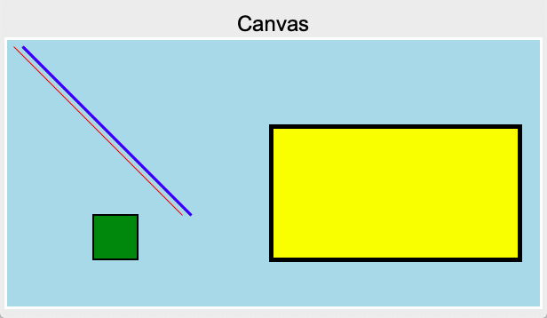
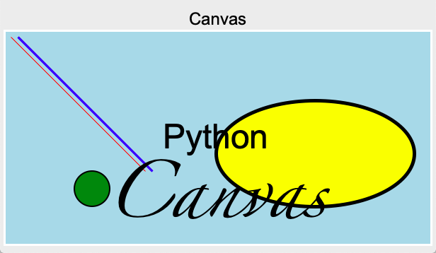
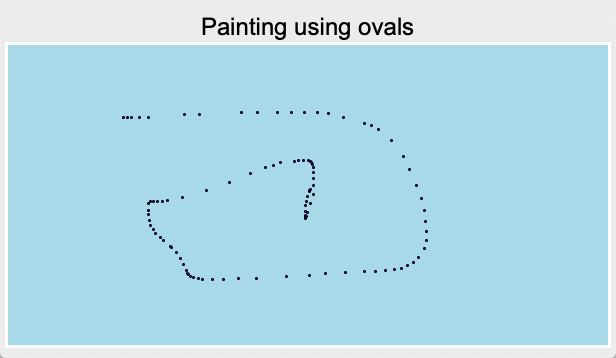
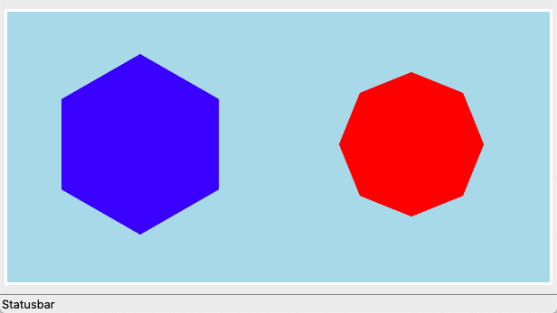
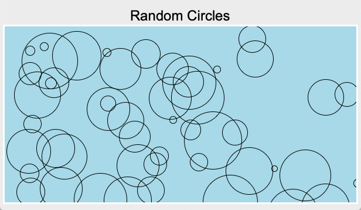
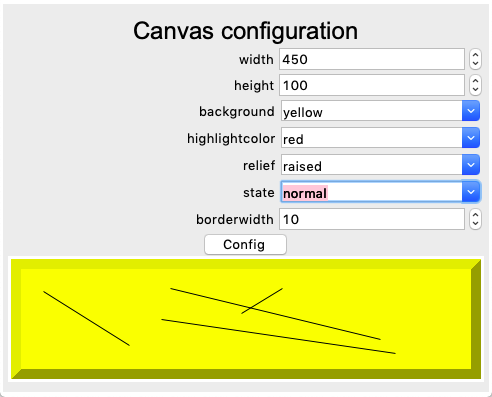
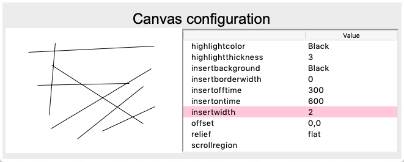
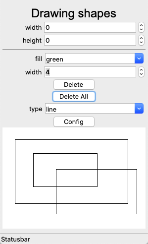
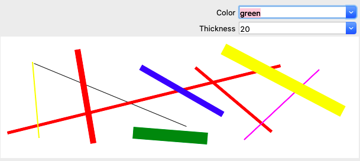

Canvas
======

The **Canvas** widget can be used to draw lines, shapes, and text 
to create complex drawings and graphs.
The origin (0, 0) of the canvas is in the top left corner.
It has the keyword options:

* background = background color
* borderwidth
* height
* width

Draw lines and rectangles
-------------------------

To draw lines and rectangles, use these **create** methods:

* create_line()
* create_rectangle()

.. literalinclude:: canvas1.py

:download:`canvas1.py<canvas1.py>`

Create text
-----------

Text can be added to a canvas with this function:

* create_text()

.. literalinclude:: canvas2.py

:download:`canvas2.py<canvas2.py>`

Paint with ovals
----------------

Small ovals can be used to paint with the mouse,
by binding a callback function to the mouse movement.

.. literalinclude:: canvas3.py

:download:`canvas3.py<canvas3.py>`

Polygons
--------

We can add our own methods to the Canvas class. 
For example we can define a method to add a polygon.

.. literalinclude:: tklib.py
   :pyobject: Canvas.polygon

.. literalinclude:: canvas4.py

:download:`canvas4.py<canvas4.py>`

Random circles
--------------

The following program places circles of random size at random locations.

.. literalinclude:: canvas5.py

:download:`canvas5.py<canvas5.py>`

Canvas configuration
--------------------

.. literalinclude:: canvas6.py

:download:`canvas6.py<canvas6.py>`

Canvas configuration with tree view
-----------------------------------

.. literalinclude:: canvas7.py

:download:`canvas7.py<canvas7.py>`

Draw shapes with the mouse
--------------------------

.. literalinclude:: canvas9.py

:download:`canvas9.py<canvas9.py>`

Draw straight lines with the mouse
----------------------------------

In order to draw with the mouse we have to add two bindings to the canvas:

- **<Button-1>** to initiate the drawing, calling the ``start()`` method
- **<B1_Motion>** to update the current drawing, calling the ``move()`` method

.. literalinclude:: draw1.py

:download:`draw1.py<draw1.py>`

