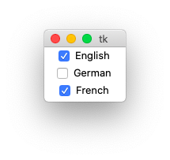

Checkbutton
===========

A **checkbutton** is like a regular button,
with a label and a callback function,
but it also holds and displays a binary state.

The ``Checkbutton`` object has the following attributes:

* **parent** - the parent object
* **text** - the label to display
* **command** - the callback function
* **variable** - the variable holding the state value
* **onvalue** - the value when in the ON state
* **offvalue** - the value when in the OFF state

The standard checkbutton
------------------------

Here is an example of 3 checkbuttons

The callback function ``cb`` writes this to the console::

    --- languages ---
    English 1
    German 0
    French fluent

We notice that the default offvalue is ``0`` and the default onvalue is ``1``.
In our case:

* var0 toggles between ``0`` and ``1``
* var1 toggles between ``barely`` and ``1``
* var2 toggles between ``0`` and ``fluent``

.. literalinclude:: check1.py

:download:`check1.py<check1.py>`

Now let us rewrite this program by using lists.

.. literalinclude:: check2.py

:download:`check2.py<check2.py>`

A better Checkbutton class
--------------------------

It's time now to define a new and better ``Checkbutton`` class which can do everything in one line::

    Checkbutton('English;German;French', 'print(self.selection)')

* the items are declared as a **semicolon-separated list**
* the command is a string to be evaluated in the Checkbutton environment
* the items are available in ``self.items``
* the selected items are available in ``self.selection``
* the selection states are available in ``self.val``

This is the result written to the console for three consecutive selections::

    ['French']
    ['German', 'French']
    ['English', 'German', 'French']

.. literalinclude:: check3.py

:download:`check3.py<check3.py>`

Now let's see how this class is defined

.. literalinclude:: tklib.py
   :pyobject: Checkbutton