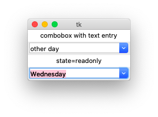
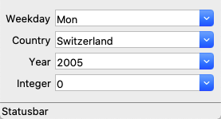

Combobox
========

A **combobox** combines an entry with a list of choices.
The user can either select text from a drop-down menu or write his own.

The first combobox allows to enter your own text, while the second one
is restricted to chose an item from the drop-down menu.

The **Combobox** class has the options

* **parent** - for the parent object
* **textvariable** - for the variable which stores the value
* **values** - for the items list
* **state** - to indicate ``readonly``

Standard Combobox
-----------------

.. literalinclude:: combo1.py

:download:`combo1.py<combo1.py>`

A better Combobox class
-----------------------

A **combobox** combines a list of choices with an entry. 
The user can select from the list, but he can also enter directly a value.

The items list can be a:

* semicolon-separated string
* integer list: [2005, 2006, 2007]
* list expression (list(range10))

.. literalinclude:: combo2.py

:download:`combo2.py<combo2.py>`

How is this new class defined ?

.. literalinclude:: tklib.py
   :pyobject: Combobox
