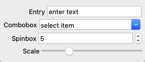
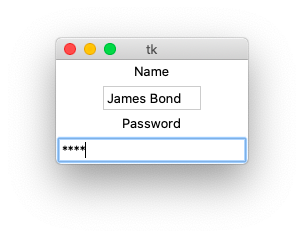
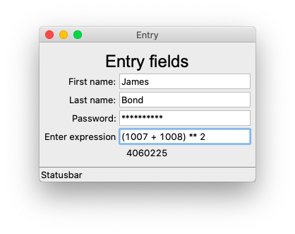
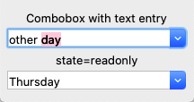
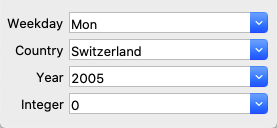
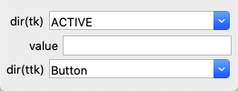
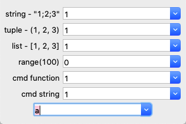
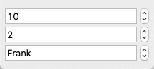
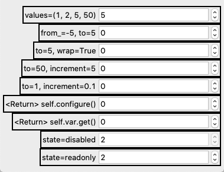
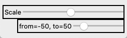

Entry, Combox, Spinbox
=========================

Several widgets allow to enter text or numerical information in a single field.

* the **Entry** widgets allows to type text
* the **Combobox** allows to either type text or select text from a drop-down list
* the **Spinbox**  allows to select from a numerical range or from a list 
* the **Scale** allows to use a slider to choose a value

:download:`entry0.py<entry0.py>`

Since these widgets are very similar, we treat them in the same section.

Entry widget
------------

An **entry** widget presents the user an empty field
where he can enter a text value.

Each ``Entry`` object has these options:

* **parent** - the parent object
* **textvariable** - the text variable to hold the entered string
* **width** - the numbers of characters
* **show** - to indicate ``*`` for passwords

They do not have a ``text`` or ``image`` option.
You have to use a label widget instead.

.. literalinclude:: entry1.py

:download:`entry1.py<entry1.py>`

A better Entry class
--------------------

It's time now to define a new and better ``Entry`` class
which can do everything in one line::

    Entry('First name:', 'print(self.var.get())')

This new class has the attributes:

* **label** - to automatically add label in front of the entry field
* **cmd** - to execute a command string when hitting the Return key
* **val** - a default value

The command function evaluates the expression entered and
displays the result in the following label widget::

    Entry('Enter expression', 'App.res["text"] = eval(self.var.get())')
    App.res = Label('Result')

.. literalinclude:: entry2.py

:download:`entry2.py<entry2.py>`

Now let's see how this class is defined

.. literalinclude:: tklib.py
   :pyobject: Entry

Combobox
--------

A **combobox** combines an entry widget with a list of choices.
The user can either select text from a drop-down menu or write his own text.

The first combobox allows to also enter your own text, while the second one
is restricted to chose an item from the drop-down menu by setting ``state='readonly'``.

The **Combobox** class has the options

* **parent** - for the parent object
* **textvariable** - for the variable which stores the value
* **values** - for the items list
* **state** - to indicate ``readonly``

Standard Combobox
-----------------

.. literalinclude:: combo1.py

:download:`combo1.py<combo1.py>`

A better Combobox class
-----------------------

A **combobox** combines a list of choices with an entry. 
The user can select from the list, but he can also enter directly a value.

The items list can be a:

* semicolon-separated string
* integer list: [2005, 2006, 2007]
* list expression (list(range10))

.. literalinclude:: combo2.py

:download:`combo2.py<combo2.py>`

How is this new class defined ?

.. literalinclude:: tklib.py
   :pyobject: Combobox

Exemple
-------

.. literalinclude:: combo3.py

:download:`combo3.py<combo3.py>`

Another exemple
---------------

The items list can be a:

* semicolon-separated string
* tuple
* list
* list expression (list(range10))

The command function can be either a string to execute
or a function.

.. literalinclude:: combo4.py

:download:`combo4.py<combo4.py>`

Spinbox
-------

A **spinbox** widget is an entry widget with built-in up and down buttons 
that are used to either modify a numeric value or to select among a set of values. 
The widget implements all the features of the entry widget. 

.. literalinclude:: spinbox1.py

:download:`spinbox1.py<spinbox1.py>`

.. literalinclude:: spinbox2.py

:download:`spinbox2.py<spinbox2.py>`

Scale
-----

A scale widget provides a way for users to choose a numeric value through direct manipulation.

.. literalinclude:: scale2.py

:download:`scale2.py<scale2.py>`
