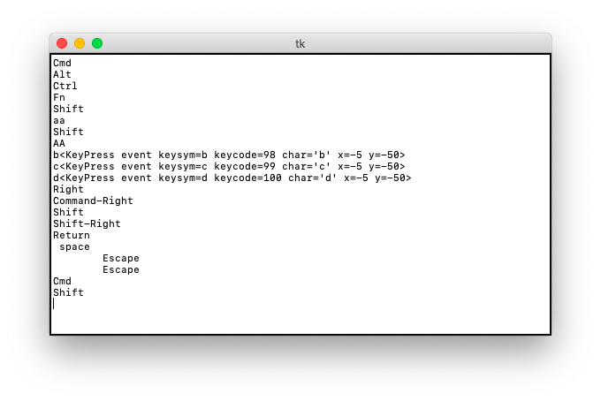

Events
======

Tk events can come from various sources including:

* mouse (move, button)
* keyboard
* widget (enter/leave)

Each widget can bind a **handler** method to an event::

    widget.bind(event, handler)

If an event matching the event pattern happens, the corresponing handler is called. 

Write events to the status bar
------------------------------

Here is an exemple which prints mouse **Button** and **Motion** events to the status bar::

    class Demo(App):
        def __init__(self):
            super().__init__()
            Label("Button and Motion events", font="Arial 24")
            Label('Display the event in the status bar')

            App.root.bind('<Button>', self.cb)
            App.root.bind('<Motion>', self.cb)

        def cb(self, event):
            """Callback function."""
            App.status['text'] = event    

This is a screen capture of the above program.

.. image:: event1.png

.. literalinclude:: event1.py

:download:`event1.py<event1.py>`

Write events to a text widget
-----------------------------

The following program sends **Button** and **Mouse** events to a Text widget,
just by changing the callback function::

    def cb(self, event):
        """Callback function."""
        App.txt.insert('end', str(event) + '\n') 

This is a screen capture of the above program.

.. image:: event2.png

.. literalinclude:: event2.py

:download:`event2.py<event2.py>`

Enter, leave and return events
------------------------------

The following program detects these events::

    App.root.bind('<Enter>', self.cb)
    App.root.bind('<Leave>', self.cb)
    App.root.bind('<Return>', self.cb)
    App.root.bind('<Configure>', self.cb)

This is a screen capture of the above program.

.. image:: event3.png

.. literalinclude:: event3.py

:download:`event3.py<event3.py>`

Keyboard events
---------------

Specific keyboard events can be bound to a specific widget and trigger a callback function.
In the example below we bind different keys to the root widget in order to call a callback function.
The callback function inserts the event despcriptor or a short text into a **Text** widget.

- **<Key>** - any key
- **a** - a lower-case a (or any other letter)
- **A** - an upper-case A
- **<Return>** - the Return key
- **<Escape>** - the Escape key
- **<Tab>** - the Tab key

Modifier keys can also bind to a callback function. 
They work equally for the left and the right keys.

- **<Shift_L>** for the Shift keys
- **<Control_L>** for the Control keys
- **<Alt_L>** for the Alt keys
- **<Meta_L>** for the Command key (on the Mac)
- **<Super_L>** for the Fn key (on the Mac)

Finally we configure the **BackSpace** key to clear the screen::

    root.bind('<BackSpace>', lambda e: text.delete('1.0', 'end'))

The *x=-5, y=-50* coordinates are the position of the widget.

This is a screen capture showing the trace of various key presses.

.. literalinclude:: event4.py

:download:`event4.py<event4.py>`

