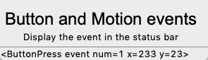
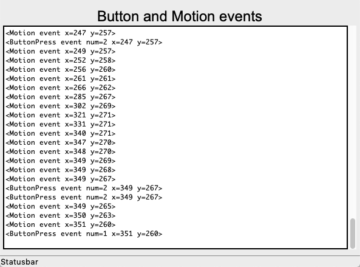
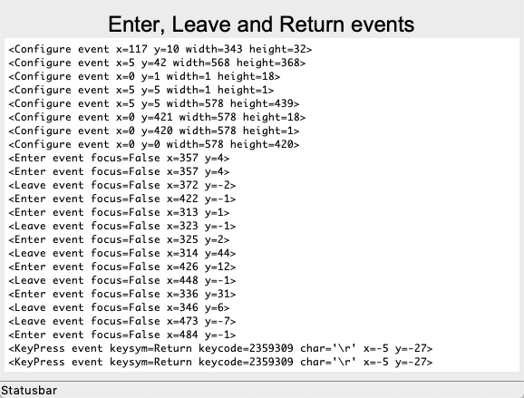

Events
======

Tk events can come from various sources including:

* mouse (move, button)
* keyboard
* widget (enter/leave)

Each widget can bind a **handler** method to an event::

    widget.bind(event, handler)

If an event matching the event pattern happens, the corresponing handler is called. 

Write events to the status bar
------------------------------

Here is an exemple which prints mouse **Button** and **Motion** events to the status bar::

    class Demo(App):
        def __init__(self):
            super().__init__()
            Label("Button and Motion events", font="Arial 24")
            Label('Display the event in the status bar')

            App.root.bind('<Button>', self.cb)
            App.root.bind('<Motion>', self.cb)

        def cb(self, event):
            """Callback function."""
            App.status['text'] = event    

This is a screen capture of the above program.

:download:`event1.py<event1.py>`

.. literalinclude:: event1.py

Write events to a Text widget
-----------------------------

The following program sends **Button** and **Mouse** events to a Text widget,
just by changing the callback function::

    def cb(self, event):
        """Callback function."""
        App.txt.insert('end', str(event) + '\n') 

This is a screen capture of the above program.

:download:`event2.py<event2.py>`

.. literalinclude:: event2.py

Enter, Leave and Return events
------------------------------

The following program detects these events::

    App.root.bind('<Enter>', self.cb)
    App.root.bind('<Leave>', self.cb)
    App.root.bind('<Return>', self.cb)
    App.root.bind('<Configure>', self.cb)

This is a screen capture of the above program.

:download:`event3.py<event3.py>`

.. literalinclude:: event3.py