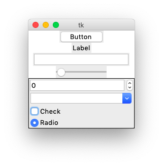

Introduction to Tk
==================

This tutorial shows how to use **objet-oriented programming (OOP)** for making **GUI** applications using the **Tk** framework. 

The principles are :

* Short code
* Automatic widget placement
* Introspection
* Same class names
* Coherent style

We are going to create the **tklib** library which redefines the following objects 
from the **tk** module and the newer themed  **ttk** module:

* Frame
* Label
* Button
* Checkbox
* Radiobutton
* Entry
* Combobox
* Listbox
* Scrollbar
* SizeGrip
* Text
* Progressbar
* Scale
* Spinbox
* Canvas

Our first program
-----------------

The traditional first program is to write **Hello world** to a window::

    import tkinter as tk

    root = tk.Tk()
    tk.Label(root, text='Hello world! Hello world!').grid()
    root.mainloop()

This is the result.

.. image:: intro1.png

First we import the Python module ``tkinter`` (Tk interface) and give it the accronym ``tk``::

    import tkinter as tk

Then we create the ``Tk()`` widget which becomes the root for all other widgets::

    root = tk.Tk()

Then we crate a ``Label()`` widget which has *root* as parent and *Hello world* as text attribute. 
To make the label appear on the window, we must call the ``grid()`` placement method::

    tk.Label(root, text='Hello world! Hello world!').grid()

Finally we call the Tk ``mainloop()`` method which keeps the window open until the **close** button is clicked::

    root.mainloop()

The same program in OOP
-----------------------

Now we rewrite this first program in OOP manner::

    class App:
        def __init__(self):
            """Define the application class."""
            self.root = tk.Tk()
            self.root.title('App Demo')
            tk.Label(self.root, text='Hello Tkinter! ' * 3).pack()

        def run(self):
            self.root.mainloop()

    if __name__ == '__main__':
        App().run()

.. automodule:: intro2
   :members:

.. image:: intro2.png

Labels
------

Labels are used to add passive text to the window. 
We define a new ``Label()`` class which is added automatically to the current
context which is stored in the class variable ``App.stack[-1]``. 
For all placement of widgets we are going to use the ``grid()`` method::

    class Label(ttk.Label):
        """Create a Label object."""
        def __init__(self, text='Label', **kwargs):
            super(Label, self).__init__(App.stack[-1], text=text, **kwargs)
            self.grid()

.. automodule:: intro3
   :members:

This is a screen capture of the above program.

.. image:: intro3.png

Buttons
-------

Buttons can be clicked and are used to execute a command associated with them.
The following demo creates 4 buttons::

    class Demo(App):
        def __init__(self):
            super(Demo, self).__init__()
            Label('Button demo',  font='Arial 24')
            Button('Start', 'print("Start")')
            Button('Stop', 'print("Stop")')
            Button('Self', 'print(self)')
            Button('Destroy', 'self.destroy()')

.. automodule:: intro5
   :members:

This is a screen capture of the above program.

.. image:: intro5.png

* The **Start** button prints *Start* to the console
* The **Stop** button prints *Stop* to the console
* The **Self** button prints the button object string to the console
* The **Destroy** button removes the button from the window

Radiobuttons
------------

Radiobuttons are active elements which can be clicked and execute actions. Only one button is active at any one time.

.. automodule:: intro6
   :members:

This is a screen capture of the above program.

.. image:: intro6.png

Checkbuttons
------------

Checkbuttons are active elements which can be clicked and execute actions. Multiple checkbuttons can be selected simultaneously.

.. automodule:: intro7
   :members:

This is a screen capture of the above program.

.. image:: intro7.png

Entry fields
------------

Entry **entry** field presents the user with a single line text field where he can enter a string value.

.. automodule:: intro8
   :members:

This is a screen capture of the above program.

.. image:: intro8.png

Combobox
--------

A **combobox** combines a list of choices with an entry. The user can select from the list, but he can also enter directly a value.

.. automodule:: intro9
   :members:

This is a screen capture of the above program.

.. image:: intro9.png

Concepts
========

The module ``tklib`` is a wrapper around ``tkinter``. 
It's role is to simplify the placement of widgets and the creation of applications.

When we import ``tklib`` we import automatically ``tk`` and ``tkk``::

    from tklib import *
    print(dir())

This is what we get when we print ``dir()``::

    ['App', 'Button', 'Callback', 'Canvas', 'Checkbox', 'Combobox', 
    'ContextMenu', 'Entry', 'Frame', 'Image', 'ImageGrab', 'ImageTk', 
    'Inspector', 'Item', 'Label', 'Labelframe', 'Listbox', 'ListboxSearch', 
    'Menu', 'Notebook', 'Panedwindow', 'Radiobutton', 'Scale', 'Scrollable', 
    'Scrollbars', 'Separator', 'Spinbox', 'Text', 'Treeview', 'Window',
    '__annotations__', '__builtins__', '__cached__', '__doc__', '__file__', 
    '__loader__', '__name__', '__package__', '__spec__', 'math', 'os', 're', 
    'sys', 'tk', 'ttk']

Let's create a root object::

    root = tk.Tk()

Comparision of ``tk``, ``ttk``, ``tklib`` Buttons
-------------------------------------------------

Now we create a classic (tk) button, a themed (ttk) button and a 
button from the ``tklib`` module. 
All ``tklib`` widgets already have convenient arguments. They automatically

* get their master from a stack
* have a default label (the widget name)
* have a default placement method (grid)

This code creates three buttons using different constructors::

    tk.Button(root, text='tk.Button').grid()
    ttk.Button(root, text='ttk.Button').grid()
    Button()

    root.mainloop()

This is how the three buttons look. We see a little bit of grey background 
around the newer themed buttons.

.. image:: concept1.png

Default appearance of ``tklib`` widgets
---------------------------------------

Let's add some more widgets and look at the result. 
The ``tk.Tk()`` root window does not have a themed background color. It remains white.
The theme's background color only is adopted after inserting the first frame.
After inserting a frame, the frame becomes the new master and all subsequent
widgets are embedded. Frames can be nested::

    root = tk.Tk()

    Button()
    Label()
    Entry()
    Scale()

    Frame()
    Spinbox()
    Combobox()
    Checkbox()
    Radiobutton()

    root.mainloop()

Here is the result. We notice the default labels Button, Label, Check and Radio.

Input widgets with labels, default value and callbacks
------------------------------------------------------

Usually an input widget needs a label next to it, so the user knows its meaning.
We therefore add a ``label`` option to the widget. If the ``label`` option is set,
a label is placed in front of the input widget and a frame is placed around them.

When an input widget is modified, a callback function can be called::

    def cb(event=None):
        print('callback')

Sometimes it is convenient to declare an executable command string, instead of 
having to declare a separate callback function. This command string is executed 
within the widget environment and ``self`` refers to the widget itself. Here 
is an example of the two types of callback functions. Both have the label *Combobox*, 
both have the values *Mon;Tue;We*. The first one calls the callback function ``cab``;
the second one executes the command string ``print(self.get())`` and prints its value::

    Combobox('Combobox', 'Mon;Tue;Wed', cb)
    Combobox('Combobox', 'Mon;Tue;Wed', 'print(self.get())', 'Wed')

It is also convenient to have default values for the input widgets. 
We add a ``val`` option which allows to set an inital value::

    Entry('Entry', cb)
    Entry('Entry', 'print(self.get())', 'text')

    Scale('Scale', cb)
    Scale('Scale', 'print(self.get())', 0.5)

    Spinbox('Spinbox', cb)
    Spinbox('Spinbox', 'print(self.get())', 50)

This is the screen capture of the above exemple:

.. image:: concept3.png

Automatic placement
-------------------

Widgets are placed automatically with the ``grid`` method.

.. autoclass:: concept4.Demo

.. image:: concept4.png
