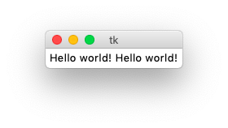
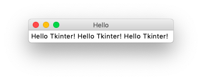
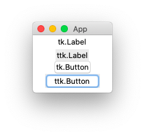
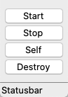
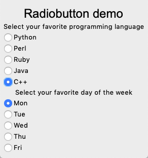
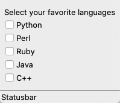
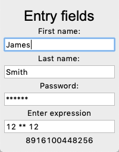
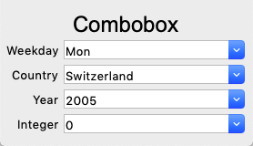
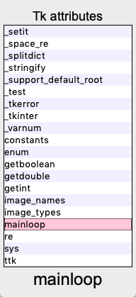

Introduction to Tk
==================

This tutorial shows how to use **objet-oriented programming (OOP)** for making **GUI** applications using the **Tk** framework. 

The principles are :

* Short code
* Automatic widget placement
* Introspection
* Same class names
* Coherent style

We are going to create the **tklib** library which redefines the following objects 
from the **tk** module and the newer themed  **ttk** module:

* Frame
* Label
* Button
* Checkbox
* Radiobutton
* Entry
* Combobox
* Listbox
* Scrollbar
* SizeGrip
* Text
* Progressbar
* Scale
* Spinbox
* Canvas

Our first program
-----------------

The traditional first program is to write **Hello world** to a window::

    import tkinter as tk

    root = tk.Tk()
    tk.Label(root, text='Hello world! Hello world!').grid()
    root.mainloop()

This is the result.

First we import the Python module ``tkinter`` (Tk interface) and give it the accronym ``tk``::

    import tkinter as tk

Then we create the ``Tk()`` widget which becomes the root for all other widgets::

    root = tk.Tk()

Then we crate a ``Label()`` widget which has *root* as parent and *Hello world* as text attribute. 
To make the label appear on the window, we must call the ``grid()`` placement method::

    tk.Label(root, text='Hello world! Hello world!').grid()

Finally we call the Tk ``mainloop()`` method which keeps the window open until the **close** button is clicked::

    root.mainloop()

The same program in OOP
-----------------------

Now we rewrite this first program in OOP manner::

    class App:
        def __init__(self):
            """Define the application class."""
            self.root = tk.Tk()
            self.root.title('App Demo')
            tk.Label(self.root, text='Hello Tkinter! ' * 3).pack()

        def run(self):
            self.root.mainloop()

    if __name__ == '__main__':
        App().run()

.. automodule:: intro2
   :members:

Labels
------

Labels are used to add passive text to the window. 
We define a new ``Label()`` class which is added automatically to the current
context which is stored in the class variable ``App.stack[-1]``. 
For all placement of widgets we are going to use the ``grid()`` method::

    class Label(ttk.Label):
        """Create a Label object."""
        def __init__(self, text='Label', **kwargs):
            super(Label, self).__init__(App.stack[-1], text=text, **kwargs)
            self.grid()

.. automodule:: intro3
   :members:

This is a screen capture of the above program.

Buttons
-------

Buttons can be clicked and are used to execute a command associated with them.
The following demo creates 4 buttons::

    class Demo(App):
        def __init__(self):
            super(Demo, self).__init__()
            Label('Button demo',  font='Arial 24')
            Button('Start', 'print("Start")')
            Button('Stop', 'print("Stop")')
            Button('Self', 'print(self)')
            Button('Destroy', 'self.destroy()')

.. automodule:: intro5
   :members:

This is a screen capture of the above program.

* The **Start** button prints *Start* to the console
* The **Stop** button prints *Stop* to the console
* The **Self** button prints the button object string to the console
* The **Destroy** button removes the button from the window

Radiobuttons
------------

Radiobuttons are active elements which can be clicked and execute actions. Only one button is active at any one time.

.. automodule:: intro6
   :members:

This is a screen capture of the above program.

Checkbuttons
------------

Checkbuttons are active elements which can be clicked and execute actions. Multiple checkbuttons can be selected simultaneously.

.. automodule:: intro7
   :members:

This is a screen capture of the above program.

Entry fields
------------

Entry **entry** field presents the user with a single line text field where he can enter a string value.

.. automodule:: intro8
   :members:

This is a screen capture of the above program.

Combobox
--------

A **combobox** combines a list of choices with an entry. The user can select from the list, but he can also enter directly a value.

.. automodule:: intro9
   :members:

This is a screen capture of the above program.

Listbox
-------

A **listbox** lets the user can select from the list. The list can be long and scrollable.

.. automodule:: listbox2
   :members:

This is a screen capture of the above program.

