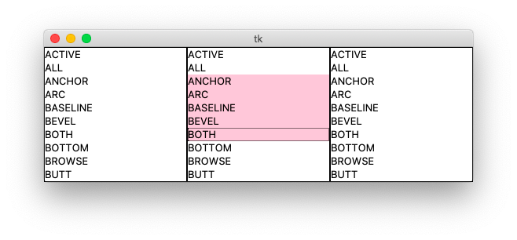
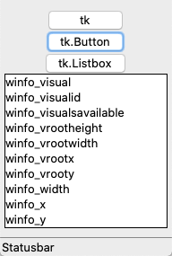
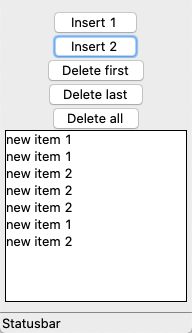
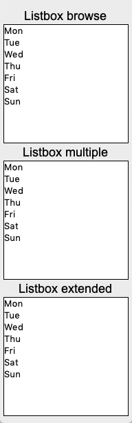
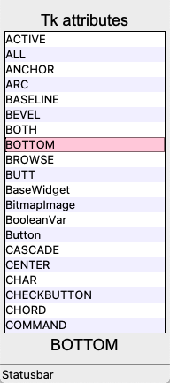
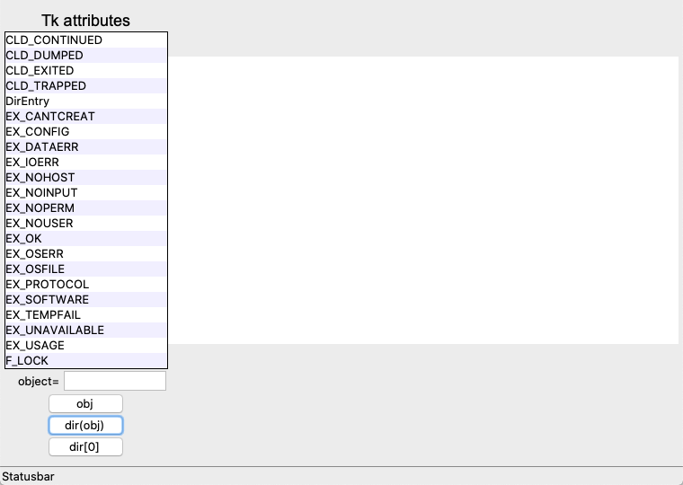

Listbox
=======

A **listbox** displays a list of single-line text items, and allows users
to browse through the list, and selecting one or more items.

.. literalinclude:: listbox0.py

:download:`listbox0.py<listbox0.py>`

Set listbox content with listvariable
-------------------------------------

The following example shows how to use the option 
``listvariable`` to change the listbox content.

.. literalinclude:: listbox0_set.py

:download:`listbox0_set.py<listbox0_set.py>`

Insert and delete listbox items
-------------------------------

The following example shows how to use the methods 
``lb.insert()`` and ``lb.insert()`` to insert and delete items.

.. literalinclude:: listbox0_insert.py

:download:`listbox0_insert.py<listbox0_insert.py>`

Another example
---------------

.. literalinclude:: listbox1.py

:download:`listbox1.py<listbox1.py>`

Listbox
-------

A **listbox** lets the user can select from the list. 
The list can be long and scrollable.

.. literalinclude:: listbox2.py

:download:`listbox2.py<listbox2.py>`

Display built-in functions
--------------------------

.. literalinclude:: listbox3.py

:download:`listbox3.py<listbox3.py>`

Listbox with search
-------------------

.. image:: listbox4.png

.. literalinclude:: listbox3.py

:download:`listbox4.py<listbox4.py>`

Regular expression
------------------

.. image:: re1.png

.. literalinclude:: re1.py

:download:`re1.py<re1.py>`

Regular expression
------------------

.. image:: re2.png

.. literalinclude:: re2.py

:download:`re2.py<re2.py>`

