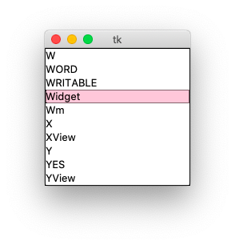
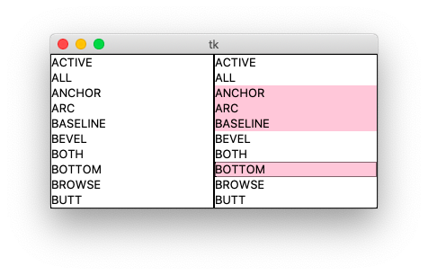
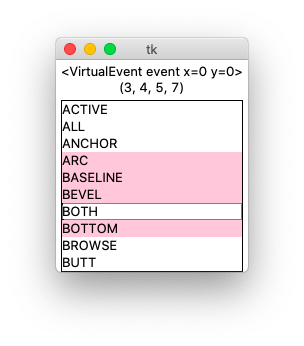
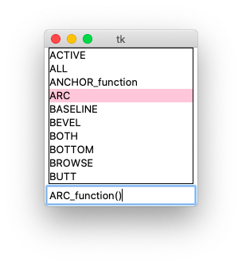
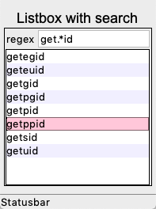
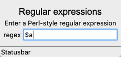

Listbox
=======

A **listbox** displays a list of single-line text items, and allows users
to browse through the list, and selecting one or more items.

..
    old way (insert/delete)
    new way (listvariable)
    browse/extended selectmode
    callback
    
    filtering
    sorting
    editing

Create a listbox the old way
----------------------------

The old way of creating a listbox, was to create an empty listbox widget 
and then to insert item by item into the listbox.

The listbox methods ``insert`` and ``delete`` allow 
to add or remove items a specific position. 
The label ``tk.END`` is used to add items to the end of the listbox.
Here three items are added at the top and one item is removed::

    lb.insert(0, 'item0', 'item1', 'item2')
    lb.delete(1)

To insert multiple items of a list one can iterate through the list::

    for item in items:
        lb.insert(tk.END, item)

or hand multiple items directly to the ``insert`` method::

    lb.insert(tk.END, *items)

.. image:: lb1.png

.. literalinclude:: lb1.py

:download:`lb1.py<lb1.py>`

Create a listbox the new way
----------------------------

The new and much simpler way of handling the listbox content is to use
the **listvariable** argument which must be set to a **StringVar** object.
The program below displays the attributes of the **Tk** module as a list:: 

    items = dir(tk)
    var = tk.StringVar()
    var.set(items)

At creation the listbox sets its **listvariable** to this list::

    tk.Listbox(root, listvariable=var).grid()

.. literalinclude:: lb2.py

:download:`lb2.py<lb2.py>`

Single and extended selection mode
----------------------------------

The ``selectmode`` argument let's the listbox be configured for 

- single item selection (browse)
- multiple item selection (extended)

.. literalinclude:: lb3.py

:download:`lb3.py<lb3.py>`

ListboxSelect callback function
-------------------------------

When the user selects an item, either with a mouse click or with the arrow keys,
a virtual **<ListboxSelect>** event is generated. 
You can bind to it to a callback function:: 

    lb.bind('<<ListboxSelect>>', cb)

The callback function prints the event descriptor and 
the current selection as an index list to a label::

    def cb(event):
        label['text'] = str(event) + '\n' + str(lb.curselection())

.. literalinclude:: lb4.py

:download:`lb4.py<lb4.py>`

Edit a listbox item
-------------------

In the following example we display the selected listbox item in an entry field.
The entry field can be edited and hitting the return key writes the new item value to the listbox.
The screen capture below shows how **ANCHOR** had been changed to **ANCHOR_function**.

.. literalinclude:: lb5.py

:download:`lb5.py<lb5.py>`

Listbox with search
-------------------

.. literalinclude:: listbox3.py

:download:`listbox4.py<listbox4.py>`

Regular expression
------------------

.. image:: re1.png

.. literalinclude:: re1.py

:download:`re1.py<re1.py>`

Regular expression
------------------

.. literalinclude:: re2.py

:download:`re2.py<re2.py>`

