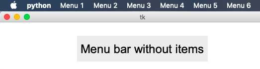
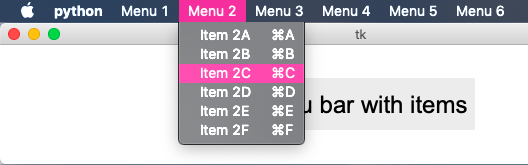
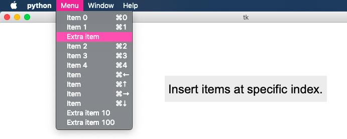
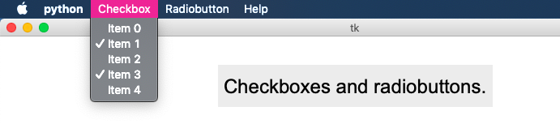
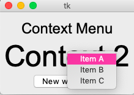
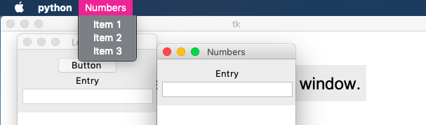
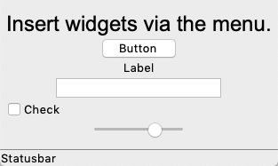
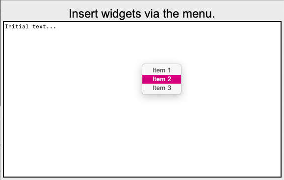

Menu
====

This section describes how to create menubars and popup menus. 
Menus are widgets as well. We add the following code to the ``App()`` class.
Creating the menu bar::

    menubar = tk.Menu(root)

Adding the menu bar to the root window::

    root['menu'] = menubar

Placing the menu bar on a ``menus`` stack for accessing to the menu items later on.

* ``menus[0]`` is always the menu bar
* ``menus[1]`` is the first menu item created
* ``menus[-1]`` is the last menu item created

This initializes the menu stack::

    menus = [menubar]

Adding a menu bar
-----------------

The ``Menu()`` class is defined like this::

    class Menu(tk.Menu):
        """Add a Menu() node to which a menu Item() can be attached."""
        def __init__(self, label, id=0, **kwargs):
            super(Menu, self).__init__(App.menus[0], **kwargs)
            App.menus[id].add_cascade(menu=self, label=label)
            App.menus.append(self)

To create a menubar we just can instantiate a series of ``Menu()`` widgets::

    for i in range(1, 7):
        Menu('Menu ' + str(i))

.. literalinclude:: menu1.py

:download:`menu1.py<menu1.py>`

Adding items to the menu bar
----------------------------

To add items to a menu bar, we first call ``Menu()`` and then ``Item()`` for each 
menu item to add to the menu: 
The Item object has the following parameters: 

* label: the text to appear in the menu item
* cmd: an executable string
* acc (accelerator): a shortcut composed of Control/Command - (hyphen) and a lower-case letter

The following exemple adds 6 items to the 6 menus previously created::

        for i in range(1, 7):
            Menu('Menu ' + str(i))
            for c in "ABCDEF":
                label = 'Item {}{}'.format(i, c)
                cmd = 'print("{}")'.format(label)
                Item(label, cmd, 'Command-{}'.format(c.lower()))

.. literalinclude:: menu2.py

:download:`menu2.py<menu2.py>`

Menus with sub-menus
--------------------

Each new menu can be attached to the menu bar (default) or can be attached
to an existing menu. The parameter ``id``.

The following code adds a new submenu at the end of the previously 
created menu. Then it adds 3 subitems, and finally an item which is directly
attached to the parent Menu()::

    for i in range(1, 7):
        Menu('Submenu in {}'.format(i), id=i)
        for c in 'XYZ':
            Item('Item ' + c, 'print(123)', 'Control-' + c.lower())
        Item('Add Item to {}'.format(i), id=i)

This is the ``Menu`` class definition.

.. literalinclude:: tklib.py
   :pyobject: Menu

This is the ``Item`` class definition.

.. literalinclude:: tklib.py
   :pyobject: Item

.. literalinclude:: menu6.py

:download:`menu6.py<menu6.py>`
6
Checkboxes and radiobuttons
---------------------------

Items can be configured as checkboxes or radiobuttons. 
The first symbol of the label decides if a command, ceckbox or radiobuttion is:

* asterisk (*) : make the item a checkbox
* hashtag (#) : make the item a radiobutton 

This is the result:

.. literalinclude:: menu4.py

:download:`menu6.py<menu4.py>`
6
Context menu
------------

The same ``Menu`` and ``Item`` widgets can be used to create context menus.
Contrary to the ``Menu`` which is attached to the root window, the ``ContextMenu`` 
is attached to a specific widget. When the widget is clicked, a callback function 
is called.

The ``Menu.post()`` method is used to open the context menu at the current 
cursor position::

    class ContextMenu(tk.Menu):
        def __init__(self, widget):
            """Create a context menu attached to a widget."""
            super(ContextMenu, self).__init__(widget)
            App.menus.append(self)

            if (App.root.tk.call('tk', 'windowingsystem')=='aqua'):
                widget.bind('<2>', self.popup)
                widget.bind('<Control-1>', self.popup)
            else:
                widget.root.bind('<3>', self.popup)

        def popup(self, event):
            """Open a popup menu."""
            self.post(event.x_root, event.y_root)
            return 'break'

.. literalinclude:: menu5.py

:download:`menu5.py<menu5.py>`

Insert an item at a specific position
-------------------------------------

Normally we build menus in order. We create a ``Menu()`` object, and then we 
add the ``Item()`` objects subsequently. With the ``insert method`` it is possible
to attach an item anywhere in the existing menu.

This inserts an new command at index=2::

    App.menus[-1].insert(2, 'command', label='Extra item')

This inserts a new command at the end::

    App.menus[-1].insert(100, 'command', label='Extra item 100')
    App.menus[-1].insert(10, 'command', label='Extra item 10')

.. literalinclude:: menu6.py

:download:`menu6.py<menu6.py>`

Different menus for each window
-------------------------------

If no new menu is defined for a new window, the root menu will be used 
for the new window. If a new menu is added after the window is created, 
this window will have it's own menu. Whenever a window becomes active, 
it will display it's own menu bar.

This shows the creation of two new windows with their different menubars::

        Window("Letters")
        Button()
        Entry()
        Menu1()
        Menu('Help', name='help')

        Window("Numbers")
        Entry()
        Menu2()

.. literalinclude:: menu7.py

:download:`menu7.py<menu7.py>`

Creating new widgets from the menu
----------------------------------

The next example shows how to add widgets dynamically.
The ``Widget`` menu contains specific widgets as items which are 
added to the current window::

    Menu('Widgets')
    Item('Button', 'Button()', 'Command-b')
    Item('Label', 'Label()', 'Command-l')
    Item('Entry', 'Entry()', 'Command-e')
    Item('Radiobutton', 'Radiobutton()', 'Command-r')
    Item('Checkbox', 'Checkbox()', 'Command-k')
    Item('Canvas', 'Canvas()', 'Command-c')
    Item('Listbox', 'Listbox(height=5)', 'Command-i')
    Item('Scale', 'Scale()', 'Command-s')
    Item('Text', 'Text(width=30, height=5)', 'Command-t')

.. literalinclude:: menu8.py

:download:`menu8.py<menu8.py>`

Insert a popup menu
-------------------

.. literalinclude:: menu9.py

:download:`menu9.py<menu9.py>`
