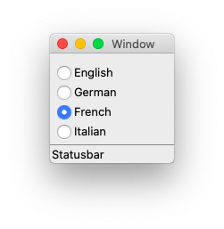
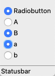

Radio Button
============

A **radiobutton** lets you choose among a number of mutually
exclusive options. Radiobuttons are used together in a set and
are appropriate when the number of choices is fairly small (about 3-5).

A ``Radiobutton`` object has these attributes:

* **parent** - the parent object
* **text** - the text label to display
* **command** - the callback function
* **variable** - the variable shared among radiobuttons of a set
* **value** - the specific value of the radiobutton

Standard Radiobutton
--------------------

Let's make a program which displays 3 radiobuttons to choose a language.

.. image:: radio1.png

.. literalinclude:: radio1.py

:download:`radio1.py<radio1.py>`

The radiobutton code consists of 7 lines and has a lot of repeated parts.

Using a list
------------

A better way would be to use a list. The code still has 7 lines,
but when we increase the number of items, the code length remains constant.

.. literalinclude:: radio2.py

:download:`radio2.py<radio2.py>`

A better Radiobutton class
--------------------------

It's time now to redefine the ``Radiobutton`` class to create everything in just one line::

    Radiobutton('English;German;French', 'print(self.item)')

* the items are declared as a semicolon-separated list
* the command is a string to be evaluated in the Radiobutton environment
* the selected value is available in ``self.item``
* the selection index is available in ``self.val`` (could be used as a list index)

.. literalinclude:: radio3.py

:download:`radio3.py<radio3.py>`

Now let's see how this class is defined

.. literalinclude:: tklib.py
   :pyobject: Radiobutton

The item string is split at the semicolon into a regular list.
The shared variable is a ``IntVar`` object.
Each radiobutton has an integer value (0, 1, 2, ...).
The callback function finds the selected item by looking up this integer value in the items list.

Let's look at another exemple. 
This time we add another language (Italian) and initialize the default button to 2 (French).

.. literalinclude:: radio4.py

:download:`radio4.py<radio4.py>`

If something goes wrong
-----------------------

Let's see what happens if there are errors in the options.

If there is no items list, there will be a single item called ``Radiobutton``.
If there is an error in the expression, this message is written to the console::

    File "/Users/raphael/GitHub/tk-tutorial/docs/radio/tklib.py", line 238, in cb
        exec(self.cmd)
    File "<string>", line 1
        print(self.item
                    ^
    SyntaxError: unexpected EOF while parsing

.. literalinclude:: radio5.py

:download:`radio5.py<radio5.py>`