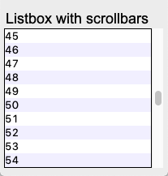

Scrollbar
=========

There are 4 widgets who can have a scrollbar:

* Text()
* Treeview()
* Canvas()
* Listbox()
* Entry()

In order to add scrollbars to these widgets we define a class which adds them
and use multiple inheritance.

In order for scrollbar and widget to interact, callback functions are assigned
on both sides. 

* The scrollbar calls the widget's **xview** and **yview** methods.
* The widget has **[x/y]scrollcommmand** options to update the scrollbar

.. automodule:: scrollbar1
   :members:

This is a screen capture of the above program.

Text with scrollbars
--------------------

.. automodule:: scrollbar2
   :members:

This is a screen capture of the above program.

Sources
-------

* http://effbot.org/zone/tkinter-scrollbar-patterns.htm