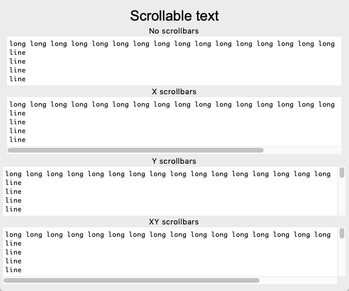
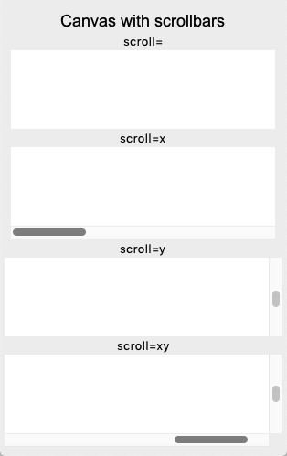

Scrollbar
=========

There are 4 widgets who can have a scrollbar:

* Text()
* Treeview()
* Canvas()
* Listbox()
* Entry()

In order to add scrollbars to these widgets we define a class which adds them
and use multiple inheritance.

In order for scrollbar and widget to interact, callback functions are assigned
on both sides. 

* The scrollbar calls the widget's **xview** and **yview** methods.
* The widget has **[x/y]scrollcommmand** options to update the scrollbar

.. image:: scrollbar1.png

.. literalinclude:: scrollbar1.py

:download:`scrollbar1.py<scrollbar1.py>`

Listbox with scrollbars
-----------------------

.. image:: scrollbar2.png

.. literalinclude:: scrollbar2.py

:download:`scrollbar2.py<scrollbar2.py>`

Text with scrollbars
--------------------

.. literalinclude:: scrollbar3.py

:download:`scrollbar3.py<scrollbar3.py>`

Canvas with scrollbars
----------------------

.. literalinclude:: scrollbar5.py

:download:`scrollbar5.py<scrollbar5.py>`

Sources
-------

* http://effbot.org/zone/tkinter-scrollbar-patterns.htm