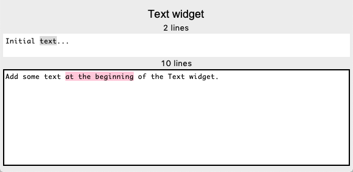

Text
====

The **Text()** widget manages muliline text.

Text
----

The **Text** widget displays multi-line text and is user editable.

.. automodule:: text1
   :members:

This is a screen capture of the above program.

