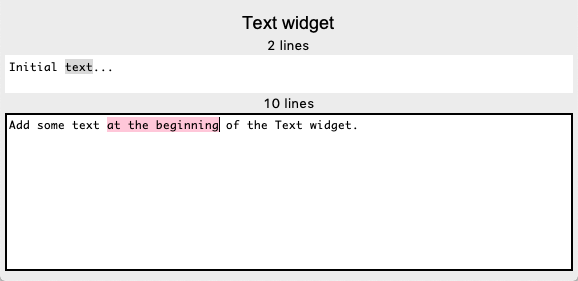
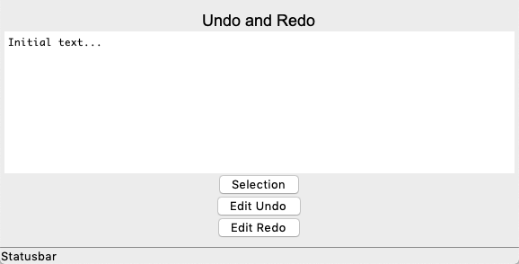
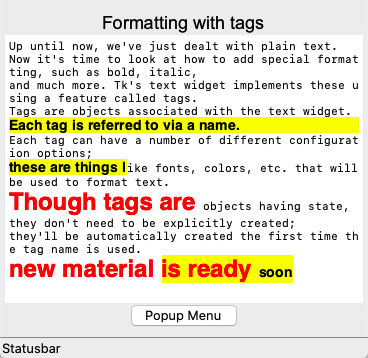
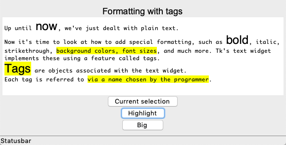
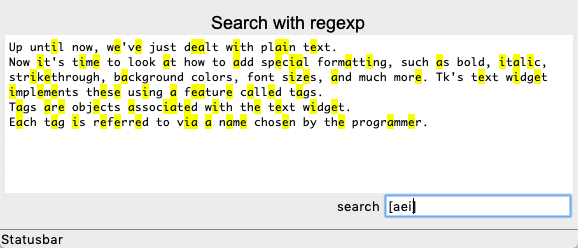
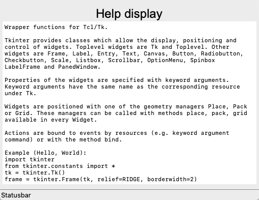

Text
====

The **Text()** widget manages muliline text.

Display multi-line text
-----------------------

The ``Text`` widget displays multi-line text and is user editable.
Its size is given in lines and characters.

.. image:: text1.png

.. literalinclude:: text1.py

:download:`text1.py<text1.py>`

Edit text
---------

Text can be edited as usual. Cut, copy, paste is possible.
The cursor can be placed with the mouse.
Mouse and and arrow key selection are both possible.

.. literalinclude:: text2.py

:download:`text2.py<text2.py>`

Undo and redo text edit
-----------------------

Text has an **Undo** and **Redo** function.

.. literalinclude:: text3.py

:download:`text3.py<text3.py>`

Format text with tags
---------------------

Text can be formatted with tags.

.. literalinclude:: text4.py

:download:`text4.py<text4.py>`

Add custom formats
------------------

Custom formats can be added.

.. literalinclude:: text5.py

:download:`text5.py<text5.py>`

Place widgets inside text
-------------------------

Widgets can be placed inside text. They move with the text.

.. image:: text6.png

.. literalinclude:: text6.py

:download:`text6.py<text6.py>`

Search inside text
------------------

Text can be searched. Regular expressions can be used. 
The exemple below shows the search for vowels which are highlighted in yellow.

.. literalinclude:: text7.py

:download:`text7.py<text7.py>`

Show a help text
----------------

Python being introspective it is easy to add help functionality.

.. literalinclude:: text8.py

:download:`text8.py<text8.py>`