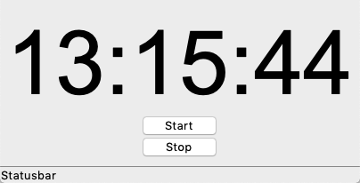

Time
====

In this section we are going to deal with time.
The goal is to build four simple applications

* clock
* timer
* alarm
* chronometer

Clock
-----

.. autoclass:: time1.Demo
   :members:

This is the result:

