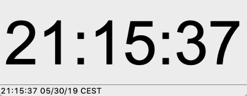
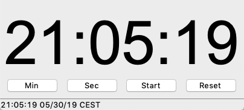

Time
====

In this section we are going to deal with time.
The goal is to build four simple applications

* clock
* timer
* alarm
* chronometer

Clock
-----

.. image:: time1.png

.. literalinclude:: time1.py

:download:`time1.py<time1.py>`

Timer
-----

Or a different layout.

.. literalinclude:: time2.py

:download:`time2.py<time2.py>`