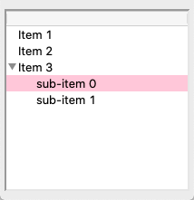
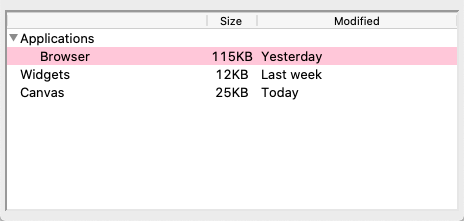
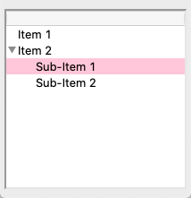
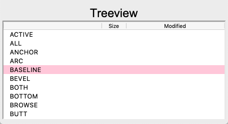
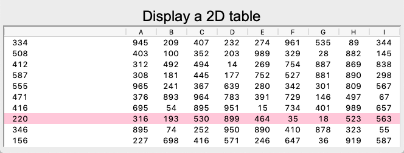
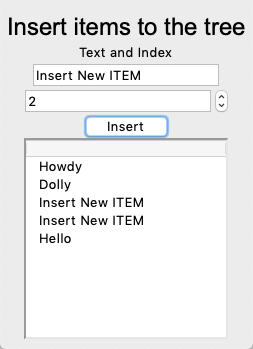
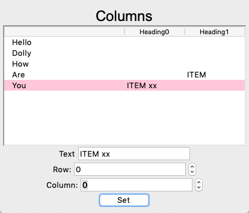
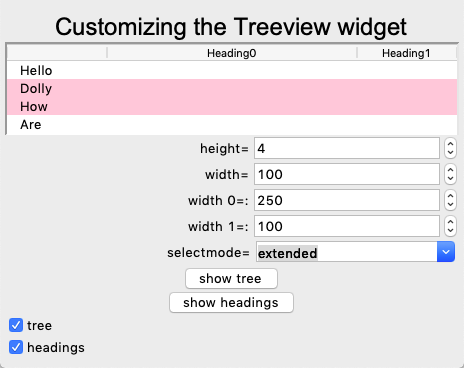

Treeview
========

A **treeview** widget can display a hierarchy of items.
The items are organized in the form of a tree.
The parent node is ``''`` and is not displayed.
Within a node the items are indexed:
0 being the first item, ``'end'`` representing the position
after the last item.

To insert an item to t treeview use the function::

    tree.insert(node, index, name, text='Label')

The first example creates a treeview, adds an item at position 0,
and another item at position ``end``.
The id of the third item is assigned to a local variable in order
to use it as a node for creating to sub-items.

.. literalinclude:: tree0.py

:download:`tree0.py<tree0.py>`

Multiple columns
----------------

The option ``tree['columns']`` adds more columns::

    tree['columns'] = ('size', 'modified')

The width, alignment and label of a column can further be specified.
To insert values to the new columns use the method ``set``::

    tree.set('widgets', 'size', '12KB')
    tree.set('widgets', 'modified', 'Last week')

To insert all values at creation use the option ``values``::

    tree.insert('', 'end', text='Listbox', values=('15KB Yesterday'))

.. literalinclude:: tree1_col.py

:download:`tree1_col.py<tree1_col.py>`

Configure style
---------------

Like the text and canvas widgets, the ``Treeview`` widget uses **tags** to
modify the appearance of lines. Tags are simply a list of strings, such as::

    tree.insert('', 'end', text='Item 4', tags=('fg', 'bg'))

Configure the tag with background and foreground color::

    tree.tag_configure('bg', background='yellow')
    tree.tag_configure('fg', foreground='red')

.. image:: tree1_tag.png

.. literalinclude:: tree1_tag.py

:download:`tree1_tag.py<tree1_tag.py>`

Bind to events
--------------

Tags are also used to bind lines to events.
This adds a callback to the button click::

    tree.tag_bind('cb', '<1>', cb)

This adds 3 virtual events::

    tree.tag_bind('cb', '<<TreeviewSelect>>', cb)
    tree.tag_bind('cb', '<<TreeviewOpen>>', cb)
    tree.tag_bind('cb', '<<TreeviewClose>>', cb)

In the callback function ``cb`` we print the event, the selection and the focus::

    def cb(event):
        print(event, tree.selection(), tree.focus())

Something like this will be printed to the console::

    <ButtonPress event num=1 x=8 y=46> ('I002',) I002
    <VirtualEvent event x=0 y=0> ('I002',) I002
    <VirtualEvent event x=0 y=0> ('I002',) I002

.. literalinclude:: tree1_bind.py

:download:`tree1_bind.py<tree1_bind.py>`

Two treeviews next to each other
--------------------------------

.. literalinclude:: tree2.py

:download:`tree2.py<tree2.py>`

Display a 2D table
------------------

.. literalinclude:: tree4.py

:download:`tree4.py<tree4.py>`

Insert items into a treeview
----------------------------

.. literalinclude:: tree5.py

:download:`tree5.py<tree5.py>`

Add items to specific column
----------------------------

.. literalinclude:: tree6.py

:download:`tree6.py<tree6.py>`

Customize the treeview widget
-----------------------------

.. literalinclude:: tree7.py

:download:`tree7.py<tree7.py>`
