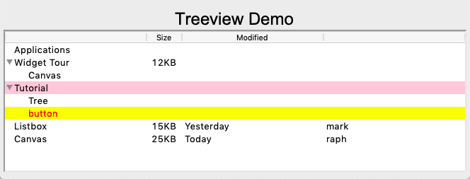

Tree
====

A **treeview** widget can display a hierarchy of items. 
The parent node is ``''`` and is not displayed. Within a node the items are indexed:
0 being the first item, ``'end'`` representing the position after the last item.

To insert an item to t treeview use the function::

    tree.insert(node, index, name, text='Label')

Overview
--------

Create a new ``Treeview`` object and assign it to a local variable::

    tree = Treeview()

Inserte a new item inside root (``''``) at index ``'end'``, 
give a name to the node (widgets)and add a label to it::

    tree.insert('', 'end', 'widgets', text='Widget Tour')

Insert another item, but this time at index 0::

    tree.insert('', 0, 'gallery', text='Applications')

Assign the item id to a local variable for later use::

    id = tree.insert('', 'end', text='Tutorial')

Inserte more items under existing nodes::

    tree.insert('widgets', 'end', text='Canvas')
    tree.insert(id, 'end', text='Tree')

Add three columns and customize them::

    tree['columns'] = ('size', 'modified', 'owner')
    tree.column('size', width=50, anchor='center')
    tree.heading('size', text='Size')
    tree.heading('modified', text='Modified')

Add a specific value (12KB) at item (widgets) and column (size) to the treeview::

    tree.set('widgets', 'size', '12KB')

Get a specific value (row, column)::

    size = tree.set('widgets', 'size')

Insert items with multiple values::

    tree.insert('', 'end', text='Listbox', values=('15KB Yesterday mark'))
    tree.insert('', 'end', text='Canvas', values=('25KB Today raph'))

Add two tags (ttk, simple) to a new item::
    tree.insert(id, 'end', text='button', tags=('ttk', 'simple'))

Configure the tag with background and foreground color::

    tree.tag_configure('ttk', background='yellow')
    tree.tag_configure('simple', foreground='red')

Add a mouse-click binding to the tag::

    tree.tag_bind('ttk', '<1>', itemClicked)  # the item clicked can be found via tree.focus()

Define a callback function for the tag::

    def itemClicked(event):
        print(event)

.. automodule:: tree1
   :members:

This is the result:

Two treeviews next to each other
--------------------------------

.. automodule:: tree2
   :members:

This is the result:

.. image:: tree2.png

Display a 2D table
------------------

.. automodule:: tree4
   :members:

This is the result:

.. image:: tree4.png

Insert items into a treeview
----------------------------

.. automodule:: tree5
   :members:

This is the result:

.. image:: tree5.png

Add items to specific column
----------------------------

.. automodule:: tree6
   :members:

This is the result:

.. image:: tree6.png

Customizing the treeview widget
-------------------------------

.. automodule:: tree7
   :members:

This is the result:

.. image:: tree7.png