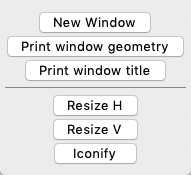
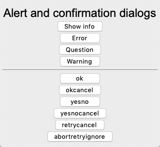
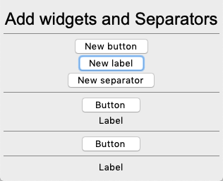
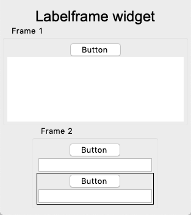
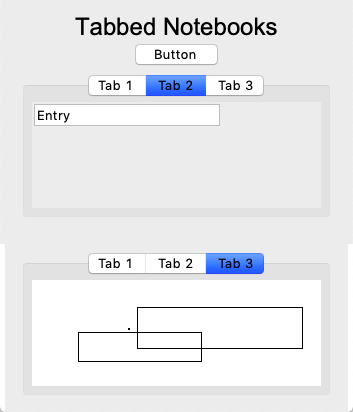
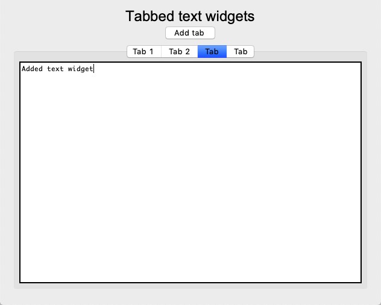

Windows
=======

In this section we present how to create new windows and 
how to open dialog windows.

To create a new window we define a new ``Window`` class 
which instantiates the ``Toplevel`` class::

    class Window():
        """Create a new window."""
        def __init__(self, title='Window'):
            top = tk.Toplevel(App.root)
            top.title(title)
            frame = ttk.Frame(top, width=300, height=200, padding=(5, 10))
            frame.grid()
            App.stack.append(frame)

First we create a toplevel window and add a title to it::

    top = tk.Toplevel(App.root)
    top.title(title)

Then we add a themed frame widget in order to get the theme's background color, 
add the geometry manager (grid) and place the frame on the widget stack,
so new widgets are added to the new window::

    frame = ttk.Frame(top, width=300, height=200, padding=(5, 10))
    frame.pack()
    App.stack.append(frame)

This is the constructor method.

.. literalinclude:: tklib.py
   :pyobject: Window.__init__

Create new windows
------------------

The following example adds two more windows besides the root window. 
Each one can be closed individually, but only if the root window is 
closed, the application ends::

    Window('Text')
    Text(height=10, width=40)

    Window('Canvas')
    Canvas()

.. literalinclude:: window1.py

:download:`window1.py<window1.py>`

The buttons have the following functions:

* **New Window** creates a new window
* **Print window geometry** prints the window placement (191x175+47+51)
* **Print window title** prints the window title (Window and dialogs)

* **Resize H** allows for only horizontal resizing
* **Resize V** allows for only vertical resizing
* **Iconify** iconifies the window

Standard dialogs
----------------

Tk provides multiple standard dialogs for 

* asking the open file name
* asking the save file name
* asking a directory name
* finding a color

.. image:: window2.png

.. literalinclude:: window2.py

:download:`window2.py<window2.py>`

Alert and confirmation dialogs
------------------------------

Tk provides multiple standard dialogs for showing

* info
* error
* question
* warning

.. literalinclude:: window3.py

:download:`window3.py<window3.py>`

Add widgets and separators
---------------------------

The following demo program shows how to insert buttons, labels and separators.

.. literalinclude:: window4.py

:download:`window4.py<window4.py>`

The Labelframe widget
---------------------

The **Labelframe** widget is a frame used for grouping widgets, 
but has a label attached to it

.. literalinclude:: window5.py

:download:`window5.py<window5.py>`

Paned windows
---------------------

The **Panedwindow** widget creates a slider and allows to change 
the width or hight between two or more widgets.

.. image:: window6.png

.. literalinclude:: window6.py

:download:`window6.py<window6.py>`

Tabbed notebooks
----------------

The **Notebook** widget creates a section with tabbed frames.

.. literalinclude:: window7.py

:download:`window7.py<window7.py>`

Add more tabs
-------------

In the following example we add more tabs by clicking on a button.

.. literalinclude:: window8.py

:download:`window8.py<window8.py>`